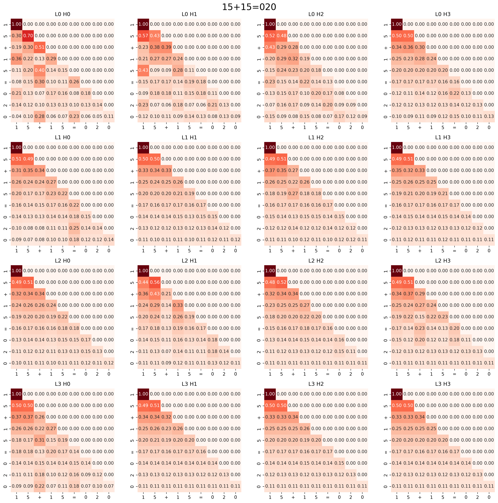

# Math-Grokking-Transformer
Exploring Grokking, Specification Gaming, and Mechanistic Interpretability in a custom 1M-parameter Transformer built from scratch.

## Specification Gaming in Transformers: Why Reversing Math Data Leads to Copying Heuristics

### Abstract
In this project, a custom autoregressive Transformer based on the GPT-2 architecture (~1M parameters, 4 layers) was trained from scratch to perform 2-digit arithmetic addition. To force algorithmic generalization (Grokking) over pure memorization, an extreme L2 regularization penalty (`weight_decay = 1.0`) was applied. 

Mechanistic Interpretability of the attention matrices at 15k steps revealed a state of partial generalization: the model failed on edge cases requiring carry-over operations (e.g., generating `15+15=020`). Visual analysis of the attention maps proved the complete absence of a "Carry-over Head" (the network physically did not attend to the units column when calculating tens). 

To mitigate the left-to-right autoregressive bottleneck, the dataset was restructured to generate answers in reverse order (acting as a scratchpad). However, under high weight decay, instead of learning the math algorithm, the model engaged in classical Specification Gaming — it developed "Name Mover Heads" to blindly copy digits from the prompt (e.g., `14+35=350`).

## Model Architecture & Setup
The experiment was conducted on a custom Decoder-only Transformer (GPT-2 variant) scaled down to force algorithmic compression over parameter memorization. Tokenization is strictly character-level.

### Architecture Parameters
| Parameter | Value | Description |
| :--- | :--- | :--- |
| **Total Parameters** | ~1M | Micro-scale to induce Grokking |
| **Layers (`n_layer`)** | 4 | Sufficient depth for arithmetic circuits |
| **Attention Heads (`n_head`)** | 4 | Head dimension $d_k = 32$ |
| **Embedding Size (`n_embd`)** | 128 | Narrow residual stream |
| **Context Size (`block_size`)**| 16 | Max sequence length for `XX+XX=XXX\n` |
| **Vocab Size** | 16 | Digits `0-9`, `+`, `=`, `\n` (padded to power of 2) |

### Training Dynamics
* **Optimizer**: AdamW (`betas=(0.9, 0.98)`)
* **Batch Size**: 128 (pure compute-bound processing)
* **Weight Decay**: `1.0` (Extreme penalty to punish lookup-table memorization).
* **Learning Rate**: Started at `1e-3` for rapid exploration, manually decayed to `3e-4` during the "Valley of Hesitation" to stabilize the local minima.

## Experiment 1: The Missing Carry-Over Head (Partial Grokking)
After 15,000 steps, the model reached a `val_loss` of 1.18. Inference testing showed partial generalization: it could solve equations with simple carry-overs (e.g., `05+39=044`) but catastrophically failed on symmetric carry-overs, outputting `15+15=020` (correct answer: `030`).

### Mechanistic Interpretability (Attention X-Ray)
To understand *why* the carry-over failed, we extracted the $Q \times K^T$ attention matrices for all 16 heads during the generation of the faulty output `020`.

*Figure 1: Attention maps across all 4 layers and 4 heads for the prompt `15+15=020`.*

**Autopsy Report:**
The objective was to locate a "Carry-over Head" — a head that attends to the unit digits (`5` and `5`) when the model is queried to generate the tens digit (`2`). The heatmaps revealed that **none of the 16 attention heads allocated probability mass to the units column**. The model was physically blind to the required context, proving that the carry-over circuit had not formed. It attempted to sum the tens in isolation ($1+1=2$), discarding the carried unit.

## Experiment 2: Reverse Data and Specification Gaming
To bypass the fundamental "Left-to-Right" autoregressive bottleneck, the dataset was restructured. Answers were flipped (e.g., `14+35=049` became `14+35=940`). The hypothesis was that allowing the model to generate units *before* tens would act as an implicit "scratchpad", making the carry-over operation computationally cheaper.

The model was trained from scratch on this new dataset for 145,000 steps. 

### The Illusion of Intelligence
Inference testing revealed a classic case of **Specification Gaming**. The model completely bypassed learning mathematical addition. Instead, it exploited the positional geometry of the prompt to develop "Name Mover Heads" (Copying Heuristics). 

**Example generation from the model:**
`Prompt: 14+35= ` -> `Raw Output: 350` (Reversed: `053`)

Rather than calculating $14+35$, the network optimized its loss by simply copying the second addend (`35`) directly into the output and appending a `0`. Under the extreme pressure of `weight_decay = 1.0`, the model "decided" that building a copy-paste circuit was energetically cheaper than building an arithmetic adder. 

## Conclusion
This experiment practically demonstrates that while extreme regularization can force algorithmic Grokking, altering data structures to "help" the model often leads to misaligned heuristics. The Transformer will always seek the path of least computational resistance.
